<div align="center">

  
  
  

  <h1>🎟️ EventGo</h1>
  
  <h3><i>The Ultimate Online Ticket Booking & Event Management System</i></h3>

  <p width="80%">
    <b>EventGo</b> is a centralized platform designed to simplify how users explore events, book tickets, and manage event logistics. 
    Empowering <b>organizers</b> with powerful management tools and providing <b>admins</b> with comprehensive control, it sets a new standard for efficient event coordination.
  </p>

  <p>
    <a href="#-features"><b>Explore Features</b></a> •
    <a href="#-tech-arsenal"><b>Tech Stack</b></a> •
    <a href="#-visual-tour"><b>Visual Tour</b></a> •
    <a href="#-getting-started"><b>Deploy Now</b></a>
  </p>

</div>

<br />

---

## 🏗 Advanced System Architecture

The following diagram illustrates the high-level architecture of EventGo, showcasing the interaction between the client interface, Spring Boot backend, and MySQL database.

```mermaid
graph TD
    subgraph Client ["🖥️ Client Layer (Frontend)"]
        Public["Public Portal"]
        User["User Dashboard"]
        Admin["Admin Panel"]
    end

    subgraph Server ["⚙️ Backend Layer (Spring Boot)"]
        Controller["REST Controllers"]
        Service["Service Layer"]
        Security["JWT Auth & Security"]
    end

    subgraph Data ["💾 Data Persistence"]
        DB[("MySQL Database")]
    end

    subgraph External ["☁️ External Services"]
        Email["SMTP (OTP/Notifications)"]
        QRCode["QR Code Generator"]
    end

    Public -->|HTTP Requests| Controller
    User -->|HTTP Requests| Controller
    Admin -->|HTTP Requests| Controller
    
    Controller --> Security
    Security --> Service
    
    Service <-->|JPA/Hibernate| DB
    
    Service -->|Generate| QRCode
    Service -->|Send| Email
```



<br />

## 🔄 Data Flow Diagram

This sequence diagram depicts the typical data flow for a ticket booking request, detailing authentication, processing, and confirmation steps.


<br />

## 🌟 Comprehensive Feature List

EventGo is a feature-rich platform designed for scalability and user experience. Below is a detailed breakdown of all implemented functionalities across the system.

### 🌍 Public Portal (No Login Required)
*   **Event Discovery**: Browse upcoming events on the landing page with details.
*   **Feedback Access**: Read approved user feedback to gauge platform reliability.
*   **Communication**: Access contact details and send messages directly to the admin.
*   **About & Feedback**: Explore the platform's mission and submit general feedback.

### 👤 User Portal & Experience
*   **Secure Authentication**:
    *   **Registration & Login**: Secure user signup and login flows.
    *   **Password Recovery**: OTP-based password recovery via email for enhanced security.
*   **Ticket Booking System**:
    *   **Browsing**: Filter and select event tickets based on categories and pricing.
    *   **Secure Checkout**: Integrated payment processing flow.
    *   **Digital Tickets**: Downloadable QR code tickets for easy entry.
    *   **History**: detailed booking history and options to cancel/disable tickets.
*   **Event Organizing**:
    *   **Create Events**: Post new events with images, details, and proof documents.
    *   **Management**: Edit or cancel pending events tailored for organizers.
    *   **Analytics**: Track ticket sales and receive payouts after event completion.

### � Administrative Control Center
*   **Dashboard & Analytics**:
    *   **Overview**: Comprehensive views of total users, events, and payment statistics.
*   **Event Management**:
    *   **Approvals**: Review, approve, or reject pending events with specific reasons.
    *   **Exports**: Download detailed event data as PDF reports.
*   **Financial Hub**:
    *   **Commission Model**: System retains a **10% commission** on ticket sales.
    *   **Tracking**: Monitor all ticket payments and manage organizer payouts.
    *   **Reporting**: Generate financial reports in PDF format.
*   **User & Feedback Management**:
    *   **User Control**: Activate/Inactivate accounts and manage roles.
    *   **Feedback Mediation**: Approve or reject user feedback for public display and reply via email.

<br />

## 🛠 Tech Arsenal

<div align="center">

| Frontend | Backend | Database & Tools |
| :---: | :---: | :---: |
|  |  |  |
|  |  |  |
|  |  |  |
|  |  |  |

</div>

<br/>

## 📂 Project Structure

A quick look at the top-level files and directories.

```text
EventGo/
├── Back_End/               # Spring Boot Application
│   ├── src/main/java       # Source code (Controllers, Models, Services)
│   ├── src/main/resources  # Config (application.properties, templates)
│   └── pom.xml             # Maven dependencies
│
├── Front_End/              # Client-side Application
│   ├── assets/             # Images, CSS, JS files
│   ├── pages/              # HTML pages (User, Admin, Public)
│   └── index.html          # Entry point
│
└── README.md
```

<br />

## 📸 Visual Tour

### 🏠 User Dashboard & Booking
<br>
<div align="center">
  
  <br/><br/>
  
  
  <br/><br/>
  
  
</div>

<br/>

### 🛠️ Admin & Organizer Controls
<br>
<div align="center">
  
  <br/><br/>
  
  
  <br/><br/>
  
  
</div>

<br />

## ⚙️ Getting Started

To run this project locally, follow these steps:

### 1️⃣ Clone the Repository
```bash
git clone https://github.com/your-username/eventgo.git
cd eventgo
```

### 2️⃣ Backend Configuration (Spring Boot)
1.  Open the `Back_End` folder in your IDE (IntelliJ IDEA / Eclipse).
2.  Update `application.properties` with your MySQL credentials:
    ```properties
    spring.datasource.url=jdbc:mysql://localhost:3306/eventgo_db
    spring.datasource.username=root
    spring.datasource.password=your_password
    ```
3.  Build and Run the application:
    ```bash
    mvn spring-boot:run
    ```

### 3️⃣ Frontend Setup
1.  Navigate to the `Front_End` directory.
2.  Open `index.html` in your browser or use a live server extension (e.g., VS Code Live Server) to launch the application.
3.  Ensure the backend is running to handle API requests.

<br/>

---

<div align="center">
  <p><i>© 2026 EventGo. All Rights Reserved.</i></p>
</div>
